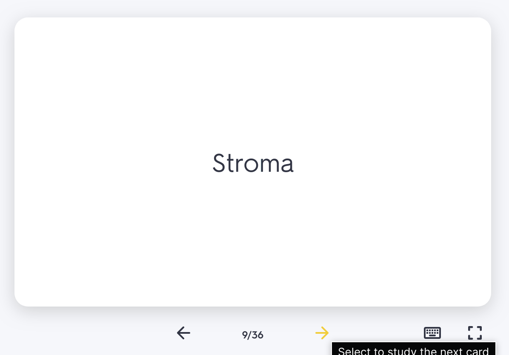

# react-quizlet-flashcard

A simple, responsive, and customizable flashcard component library for React, inspired by Quizlet. Create interactive single flashcards or decks with smooth animations and TypeScript support.

[](https://www.npmjs.com/package/react-quizlet-flashcard)

|                                          react-quizlet-flashcard                                           |                                       Quizlet's flashcard component                                        |
| :--------------------------------------------------------------------------------------------------------: | :--------------------------------------------------------------------------------------------------------: |
|  |  |

## ✨ Features

- **Single Flashcard**: Use the `Flashcard` component for individual cards with flip animations.
- **Flashcard Deck**: Use the `FlashcardArray` component to navigate through multiple cards with progress tracking.
- **Customizable**: Style cards with CSS properties, support for JSX/HTML content, and configurable flip directions.
- **TypeScript Support**: Fully typed for type-safe development.
- **Responsive Design**: Adapts to various screen sizes with customizable styles.
- **Accessibility**: Includes ARIA attributes for screen reader compatibility.

## Demo

Explore the full documentation and live demos at [react-quizlet-flashcard website](https://react-quizlet-flashcard.vercel.app/).

## Installation

```bash
npm install react-quizlet-flashcard
```

or

```bash
yarn add react-quizlet-flashcard
```

## 📖 Usage

### FlashcardArray Example

```tsx
import { FlashcardArray } from 'react-quizlet-flashcard'
import 'react-quizlet-flashcard/dist/index.css'

const deck = [
  {
    id: 1,
    front: { html: <div>What is the capital of Alaska?</div> },
    back: { html: <div>Juneau</div> },
  },
  {
    id: 2,
    front: { html: <div>What is the capital of California?</div> },
    back: { html: <div>Sacramento</div> },
  },
]

function App() {
  return <FlashcardArray deck={deck} />
}
```

### Flashcard Example

```tsx
import { Flashcard } from 'react-quizlet-flashcard'
import 'react-quizlet-flashcard/dist/index.css'

function App() {
  return (
    <Flashcard
      front={{ html: <h1>Front</h1> }}
      back={{ html: <h1>Back</h1> }}
    />
  )
}
```

## 📚 Documentation

Visit [react-quizlet-flashcard.vercel.app](https://react-quizlet-flashcard.vercel.app/) for detailed documentation, including:

- Props for `Flashcard` and `FlashcardArray` components.
- Usage of `useFlashcard` and `useFlashcardArray` hooks.
- Customization options and accessibility features.

## 🤝 Contributing

Contributions are welcome! Check out the [issues page](https://github.com/ABSanthosh/react-quizlet-flashcard/issues) on GitHub to report bugs or suggest features. Give us a ⭐️ if you find this project helpful!

## 📝 License

This project is licensed under the MIT License.

## TODO

- [x] Flashcard array needs a new feature to delete and add cards dynamically. That should also update the `cardsInDisplay` state and current card index.
- [ ] When cycle is enabled after the array was initialized, at the start of the flashcard array (1/7), it breaks.
